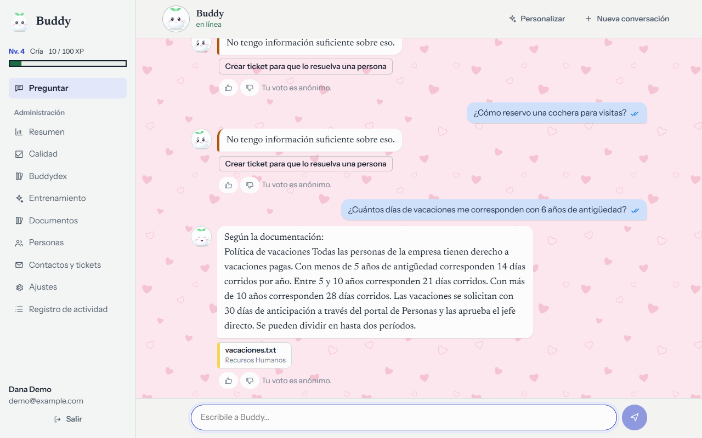
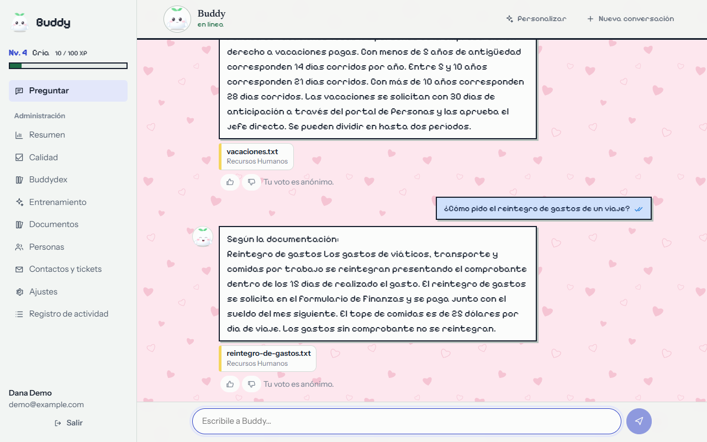
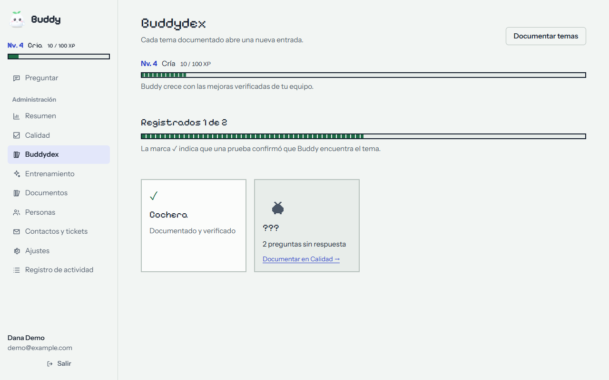
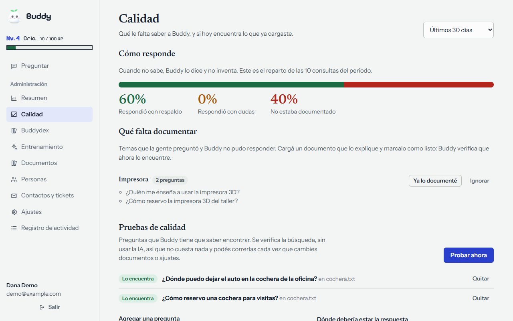
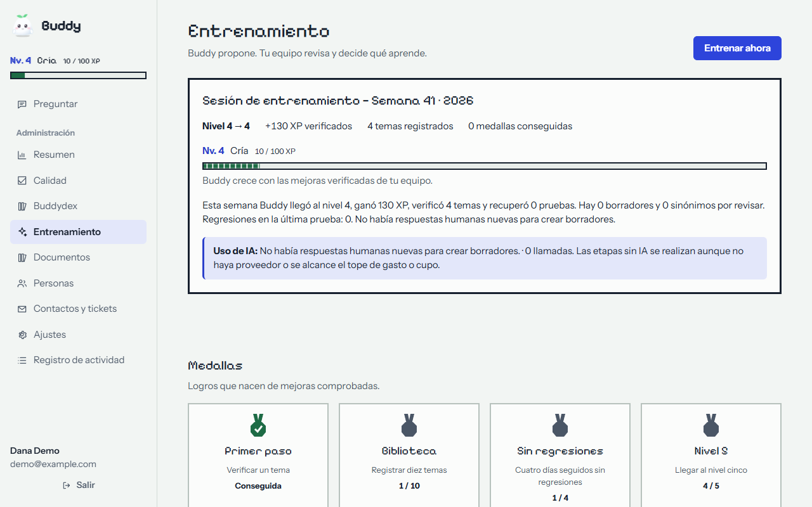
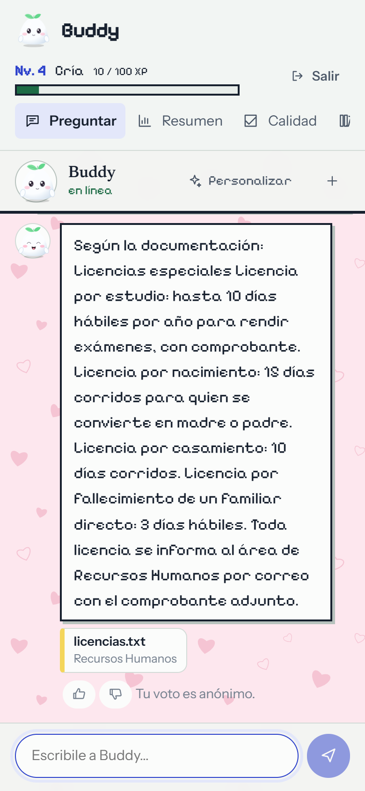

# Buddy

A self-hosted assistant that answers your team's questions **using your own documents** — and shows where each answer came from.

Upload PDFs, Word files and text, or connect a Google Drive folder. People ask in plain language; Buddy finds the relevant passages, answers from them, cites its sources, admits when the documents don't say, and tells the person who to ask next. You bring your own AI provider key (Gemini, OpenAI, Claude, or any OpenAI-compatible server such as Ollama). Your documents stay on your server; only the passages needed for each question go to the provider you chose.

Spanish-first (the interface and the assistant speak Spanish); see [README.es.md](README.es.md).

**What makes it different:** most document chatbots only answer. Buddy also tells you what it *doesn't* know. Every unanswered question is grouped by topic in **Calidad → Qué falta documentar**; you write the missing document, mark the topic as done, and Buddy checks (for free, no AI calls) that it now finds it. Questions it keeps failing to answer come back on their own. The result is a knowledge base that improves every week, not just a bot.

## Screenshots

| Chat with sources | Retro *GBA mode* | Buddydex |
|---|---|---|
|  |  |  |

| What's missing from your docs | Weekly training | On mobile |
|---|---|---|
|  |  |  |

## Install (3 steps)

Requires Docker with Compose.

```bash
cp .env.example .env        # optional: change the port
docker compose up -d
```

Open <http://localhost:8080>. The first screen asks you to create the administrator account. Then, in **Ajustes**, paste your AI provider key and press *Probar conexión*; in **Documentos**, create a collection and upload files.

Put it behind HTTPS (any reverse proxy) before exposing it to the internet, and set `BUDDY_COOKIE_SECURE=1`.

## What you get

- **A character, not a text box.** Pick who greets your team: Mochi, Kitsu, Neko, Nube, Conejo or Osito, in eight colors, with a voice (warm, professional or playful). It blinks, follows the cursor, thinks while it answers, doubts when the documents don't say, melts when someone says thanks and falls asleep if left alone. Everyone gets chat-app bubbles, ten wallpaper patterns, their own message color, and accessories that unlock as they use it (all decorative; respects *reduced motion*).

- **Answers with sources.** Hybrid retrieval: full-text search in Spanish (typo correction, synonyms, follow-up questions understood from the previous turn) plus optional search by meaning with embeddings.
- **Accounts and roles.** Administrator, editor (manages documents, sees statistics) and user. Passwords hashed with Argon2id, lockout after repeated failures, sessions you can revoke, an activity log.
- **Who can read what.** Each collection is open to everyone or to specific groups. Permissions are applied in the database query, before anything is scored or sent to the AI. Changing permissions discards affected conversations.
- **Honesty.** When the documents don't answer, Buddy says so, shows a contact (configurable per topic) and can open a ticket. Contradicting documents and weak evidence are flagged.
- **Anonymous feedback.** 👍/👎 votes carry no user and no timestamp; unanswered questions are listed so you know what to document.
- **Cost controls.** Per-person and company-wide daily limits, concurrency cap, and one provider call per question.
- **Secrets at rest.** The API key and the Google service account are stored encrypted and are never shown again.

## A Buddy that grows

Buddy has an **XP bar and levels** (egg → chick → young → adult → legendary), a **Buddydex** and **medals**, in an optional retro handheld-style theme (*GBA mode*, with pixel font and 8-bit sounds, both opt-in per person). The game is honest by design:

- **XP only comes from verified improvements** — a topic you documented and the search test now confirms, a failing test back to green, a higher share of answers backed by documents. Never from chatting or usage, so it can't be inflated. Regressions are reported, never hidden.
- **Buddydex**: every documented topic is a registered entry; topics people keep asking about that you haven't documented show up as silhouettes (`???`).
- **Weekly training session** (admins and editors): Buddy *proposes* documentation drafts built only from answers your team already wrote in resolved tickets, plus synonym suggestions and a report of which search settings score best. **A person approves everything**; nothing enters the knowledge base on its own, and settings are never changed automatically. The AI part respects the usage quotas and is skipped (with a notice) if no provider is configured.

Drafts are built from ticket text, so review them for personal data before approving: only emails, links and long numbers are masked automatically before text goes to your AI provider.

All characters and artwork are original.

## Operate

| Task | How |
|---|---|
| Add people | *Personas* → *Agregar persona* (a temporary password is shown once) |
| Restrict a collection | *Documentos* → *Editar* → groups |
| Google Drive | *Ajustes* → paste the service-account JSON, share each folder (read-only) with its email, *Documentos* → collection of type Drive |
| Search by meaning | *Ajustes* → *Búsqueda por significado* (off by default: it sends all document text to the provider to compute vectors) |
| Back up | `docker compose exec db pg_dump -U buddy buddy > buddy.sql` and keep the `buddy-data` volume (it holds the key that decrypts your stored API keys) |
| Update | `git pull && docker compose up -d --build` |

Run a single application container (the default): the sync scheduler and rate limiters live in the process. Concurrent requests are served by a thread pool.

## Security notes

- Set `BUDDY_SETUP_TOKEN` if the port is reachable before you finish the first-run setup: the first administrator then needs that code.
- Behind a reverse proxy, set `BUDDY_TRUSTED_PROXIES` to its IP; otherwise `X-Forwarded-For` is ignored (it would let anyone spoof their IP).
- The AI provider address (*custom* provider) is administrator-only and may point to a private address on purpose, so local models such as Ollama work. Only cloud-metadata/link-local addresses are refused.
- Logins are throttled per account **and** IP (accounts are never locked out for good). Sessions, old conversations, statistics and the activity log are purged automatically; the link between a person and their anonymous 👍/👎 vote is cut ten minutes after voting.
- The text of a question is stored only when Buddy could not answer it (so you know what to document) or if you enable *Guardar preguntas*; never together with the person's name.

## Develop

```bash
# backend (Python 3.12) — tests need a PostgreSQL; see backend/tests/conftest.py for the URL
cd backend && python -m venv .venv && .venv/bin/pip install -r requirements-dev.txt
.venv/bin/python -m pytest -q

# frontend
cd frontend && npm ci && npm test && npm run build     # builds into backend/static
```

`backend/dev/stub_llm_server.py` is an OpenAI-compatible fake provider for trying the whole flow without spending API credits.

## License

MIT — see [LICENSE](LICENSE) and [NOTICE.md](NOTICE.md).
